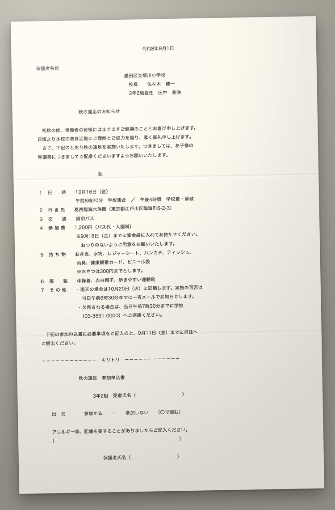
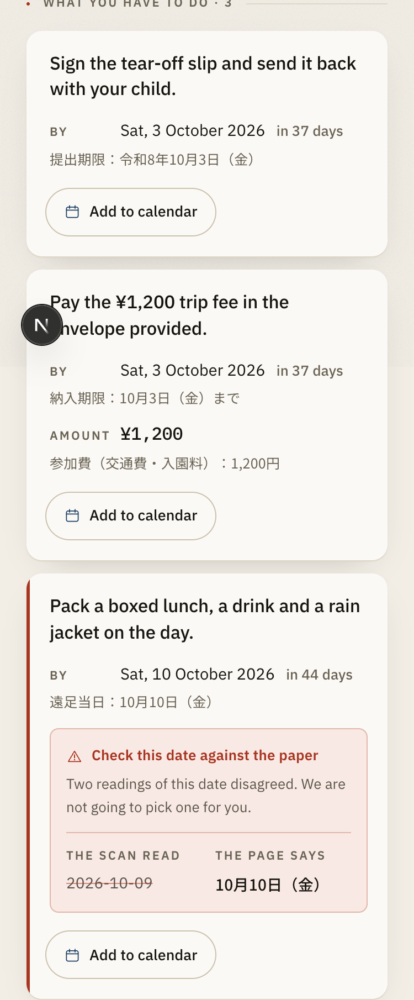
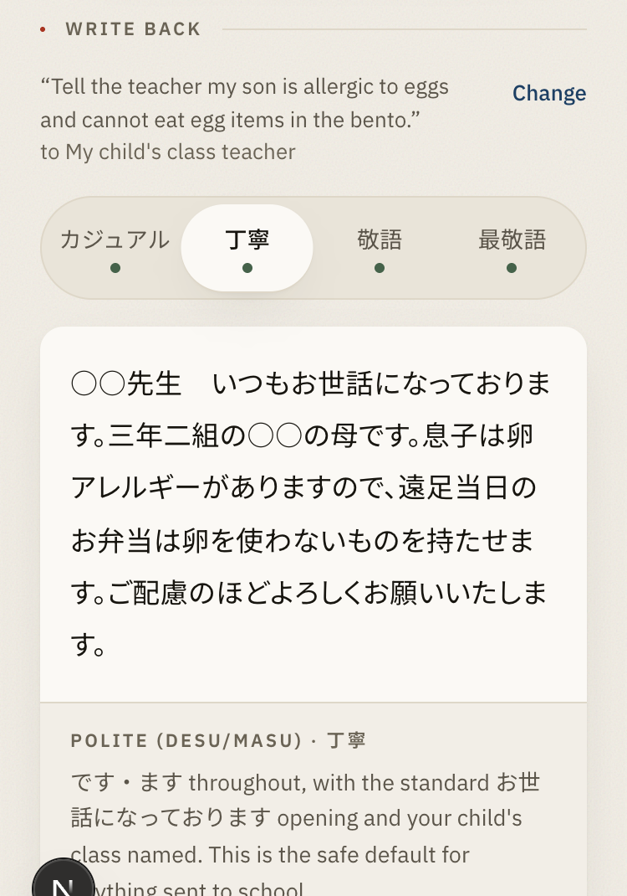
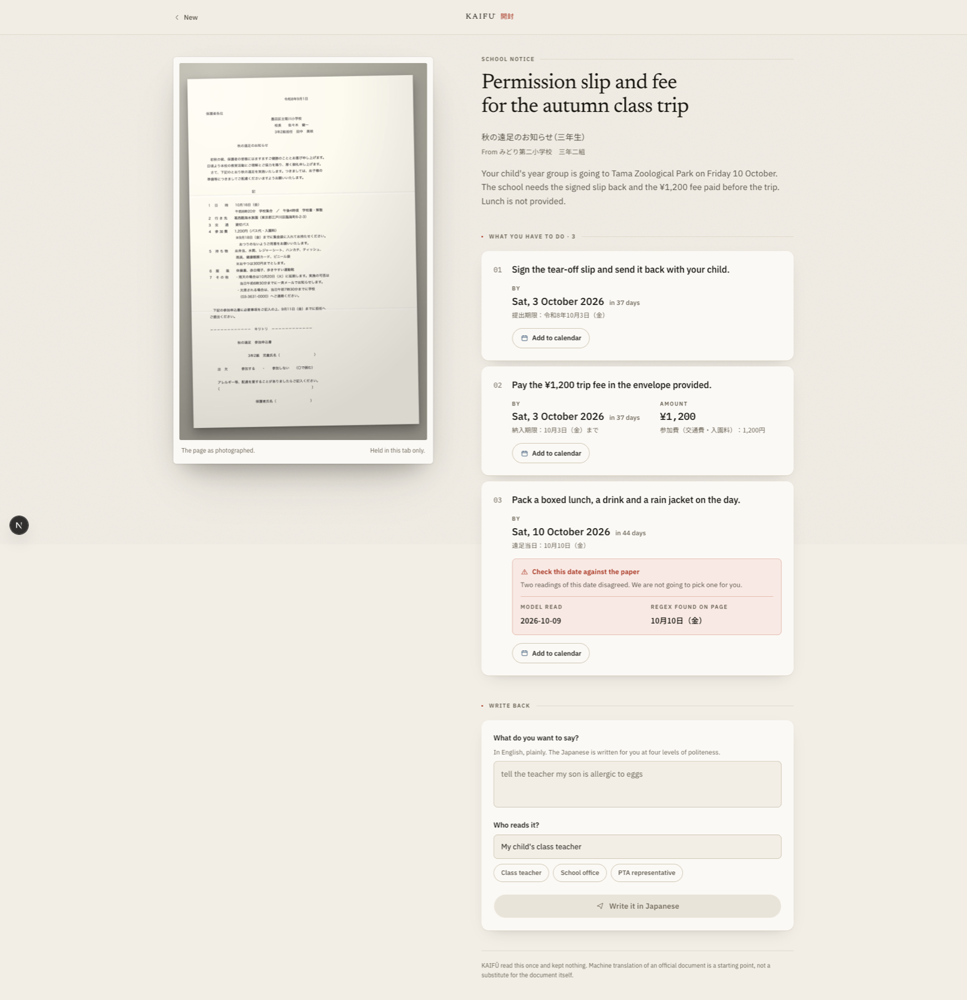
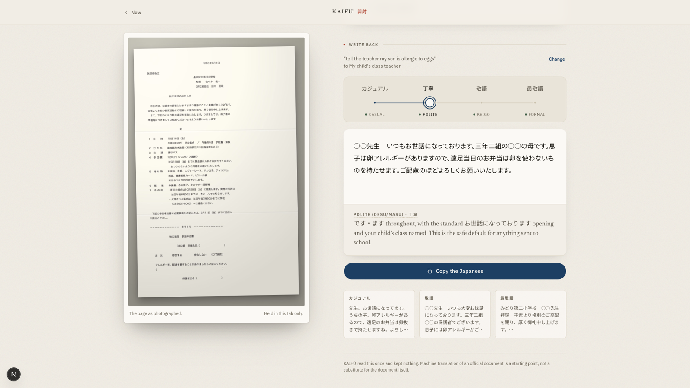
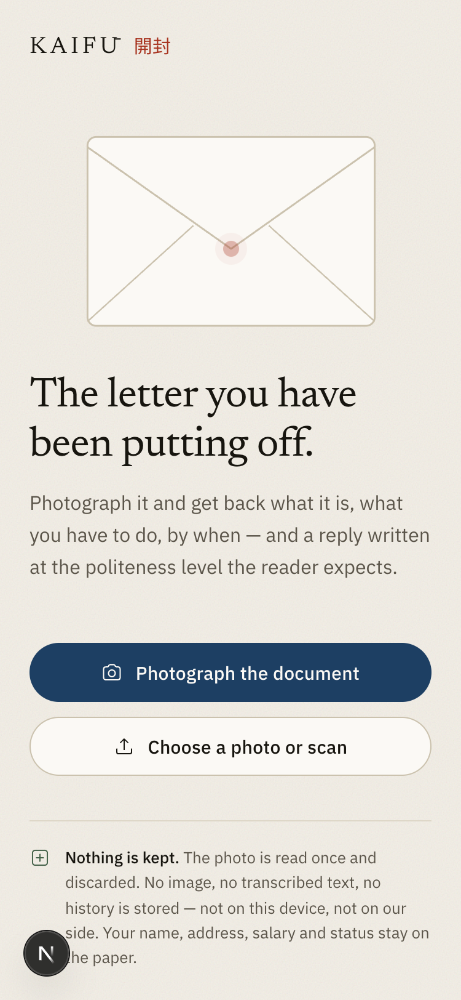
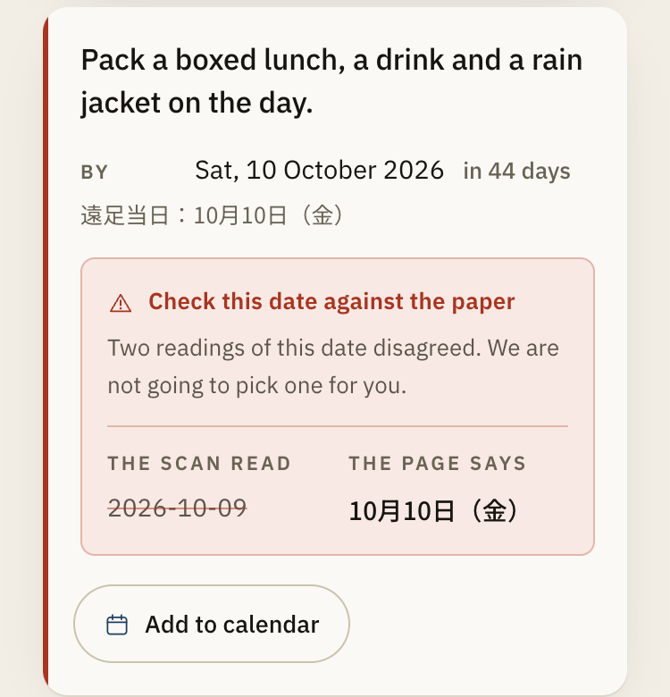
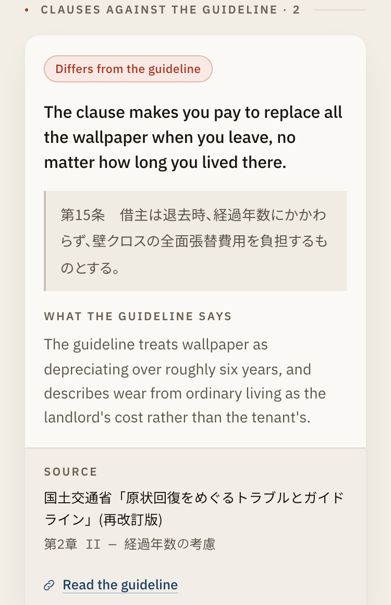

# KAIFŪ 開封

Photograph a Japanese document and get back what it is, what you must do, by when, and a
reply you can send at the politeness register the reader expects.

**Live:** https://kaifu-one.vercel.app — try `/?mock=1` (school notice), `/?mock=lease` (lease clause vs MLIT guideline), or photograph a real document.

[](https://github.com/Sizbei/kaifu/actions/workflows/ci.yml)
[](LICENSE)
[-c0392b.svg)](https://shisa.ai)

<p align="center">
  
  
  
</p>
<p align="center">
  <sub>Left: the input, a rendered sample from <code>public/samples/</code> (the app is built for a phone camera; on a desktop you upload one of these).
  Middle: the card. Three things to do, each with the printed date beside the parsed one; the third is flagged because two readings disagreed.
  Right: the same intent written in Japanese at 丁寧, with a one-line gloss. The slider above it moves between four finished drafts.
  The card and reply shown are the app's built-in mock scenario (<code>?mock=</code>, used by the e2e suite), not a live decode of the left image.</sub>
</p>

開封 means opening a sealed envelope. A print-out in a child's school bag, a notice from the
ward office, a clause in a lease renewal: a translation app will tell you what the words
say. It will not tell you that you have eleven days to return a stamped form, how much to
pay, or what to write back. Japan had 4,125,395 foreign residents at the end of 2025 and
84,759 public-school students who need Japanese-language support; boards of education
employ 7,301 native-language support staff whose job description includes translating
documents for parents (sources and corrections in
[docs/market-evidence.md](docs/market-evidence.md)). Nothing currently tells those
households what a document *means they must do*.

---

<p align="center">
  
  
</p>
<p align="center"><sub>Desktop: the paper stays beside its decode; the reply panel shows the same message at four politeness levels.</sub></p>

## What it does

**DECODE** (free). What is this document, what must you do, and by when. One tap
downloads an `.ics` for each deadline. Covers school notices, ward-office and tax mail, and
lease clauses.

**JUDGE** (paid tier, unmetered in v0). A lease clause set beside the relevant published
国土交通省 (MLIT) guidance, in the user's language, with the source and section shown.
Comparison and translation only.

**REPLY** (the differentiator). The user's intent, written in Japanese at four registers,
カジュアル / 丁寧 / 敬語 / 最敬語, generated concurrently and streamed together, with a
one-line English gloss of what changed at each level and why it suits the reader. Knowing
*what* to reply is a translation problem. Knowing whether this ward-office clerk gets 丁寧
or 敬語, and what it signals when you get it wrong, is the thing no dictionary tells you.

### Two guarantees



**v0 persists nothing.** No image, no document text, no extracted fields, no history. The
photograph is downscaled in the browser, posted to the API, held in memory for the length
of the request, and dropped. Nothing is written to disk or to a database unless you
explicitly opt in to the corpus graph, and then only categorical and numeric facts
(document type, obligation kind, amount, days-until-due, clause type, guideline status),
never text, names, issuers, or images; see [docs/ARCHITECTURE.md](docs/ARCHITECTURE.md) §7
for the exact field list. These documents contain names, addresses, salaries, and
residence status, and the shortest path to not leaking them is not to keep them.

**This is not legal advice.** The JUDGE layer translates a clause and places it beside
published government guidance, with the citation shown. It never says a clause is illegal,
unfair, void, or unenforceable. `"differs"` is the strongest word in the vocabulary (see
`JudgeFindingSchema.status` in [`src/lib/types.ts`](src/lib/types.ts)). Japan's 弁護士法
(Attorney Act) Article 72 restricts non-lawyers from providing legal services for a fee,
and the citation-or-silence rule is how the product stays on the right side of it: a
finding without a citation is not a finding, and is dropped rather than softened.

<br clear="right">

---

## How it works

```
camera → downscale client-side → /api/decode
              ├─ OpenAI vision  → structured JSON ONLY (OCR, classification, field extraction)
              ├─ deterministic regex pass over the raw transcription (dates, amounts)
              └─ cross-check: model vs document. Disagreement is SHOWN, never silently resolved
                     ↓
              Shisa (Japan-hosted, api.shisa.ai/openai/v1) → all Japanese generation + register work
```

### The seam

Shisa never does OCR; the vision model never generates Japanese. The vision model sees the
image and returns `VisionResultSchema` (document type, confidence, raw transcription,
dates, amounts, obligations). Shisa sees text and returns Japanese. "Japanese text is
processed in Japan" is a promise made to the user, so it has to hold at the level of code:
`src/lib/vision.ts` returns only JSON, and `src/lib/shisa.ts` never receives an image.
The same file allowlists the `shisa-ai/*` model prefix and refuses anything else at client
construction, because the Shisa gateway also serves models that are not Japan-hosted.

### The cross-check



A wrong deadline is worse than no answer. Dates and amounts are extracted twice: once by
the model, once by a deterministic regex pass over the raw transcription
(`src/lib/extract.ts`, which reads 令和8年9月5日 alongside Western dates and `3,200円` /
`¥3,200` alongside each other). When the two disagree, the obligation is still shown, with
both values and the conflict visible (`Obligation.conflict`). The UI does not pick a
winner, average, or prefer either source. The user has the paper; we do not.

Below `CONFIDENCE_THRESHOLD` (0.6) the card degrades to `summaryOnly`: a translated
summary, an empty obligation list, and the reason stated. A crumpled, hand-annotated
school print should produce less, not something confidently wrong. `docType: "unknown"`
routes the same way and is a correct outcome, not a failure.

<br clear="right">

### Citation or silence



A `JudgeFinding` carries the clause as printed, a plain-language restatement, what the
cited guideline says, and a citation (`source`, `section`, `url`) that is not optional. A
finding whose citation does not resolve to an entry in `src/lib/groundtruth.ts` is dropped
in code, not hedged. The citation is rendered with the finding, never behind a tooltip.

Retrieval decides the candidate set and nothing more. The clause is embedded (OpenAI
`text-embedding-3-small`, vectors only) and searched in Qdrant; hits below the score
threshold are discarded, and the store returns only ids that are resolved back through the
corpus, so nothing planted in the vector store can become a source. With `QDRANT_URL`
unset, JUDGE falls back to keyword routing.

<br clear="right">

### The register engine

Four concurrent Shisa completions per reply, one per register, streamed as NDJSON events
tagged by register. The client buffers each independently; the slider selects between
buffers and never starts work. A single register failing errors that register alone.
Prompts and exemplars live in `src/lib/prompts/`.

Register quality is not unit-testable, so it has its own eval:
[`scripts/eval-registers.ts`](scripts/eval-registers.ts) runs ten realistic scenarios
through the product's own `streamRegisters` and writes
[docs/register-eval.md](docs/register-eval.md). The latest run (2026-08-27,
`shisa-v2.1-llama3.3-70b`) reports a **70% pass rate: 7 of 10 scenarios with zero
error-level flags** from the automatic checks, with all four registers distinguishable at
every step (no near-identical adjacent pair) and one scenario showing no formality gain
between 丁寧 and 敬語. Those checks count honorific markers; they cannot tell whether a
marker points at the right person, which is where keigo actually goes wrong. A native
speaker has not yet reviewed the sheet. See "Help wanted" below.

Full detail is in [docs/ARCHITECTURE.md](docs/ARCHITECTURE.md); the v0 scope decisions
are in [docs/superpowers/specs/2026-08-27-kaifu-v0-design.md](docs/superpowers/specs/2026-08-27-kaifu-v0-design.md).

---

## Sponsors in the pipeline

Built at a Tokyo hackathon. Each sponsor's stack is actually in the request path:

| Sponsor | What it does in KAIFŪ | Where in the code |
| --- | --- | --- |
| [Shisa](https://shisa.ai/ja/) | All Japanese generation, Japan-hosted: card summary, JUDGE restatements, the four-register reply engine. Model allowlist. | `src/lib/shisa.ts`, `src/lib/prompts/`, `src/lib/complete.ts` |
| [OpenAI](https://openai.com/) | Vision: OCR, document classification, field extraction as strict structured JSON. `text-embedding-3-small` for retrieval vectors. Never Japanese generation. | `src/lib/vision.ts`, `src/lib/doctypes.ts`, `src/lib/embed.ts` |
| [Qdrant](https://qdrant.tech/) | Vector retrieval over the MLIT ground-truth corpus (`kaifu_groundtruth`) and the fixture clause collection (`kaifu_clauses`) that seeds the "is this clause normal?" benchmark. | `src/lib/retrieval.ts`, `scripts/index-groundtruth.ts` |
| [Neo4j](https://neo4j.com/) | The opt-in anonymized corpus graph: documents → obligations → clause types → guideline citations. Returns per-guideline benchmark counts in the `X-Kaifu-Benchmark` header. | `src/lib/graph.ts`, `src/lib/benchmark.ts`, `scripts/seed-graph.ts` |

Thanks to [CreatorLabo](https://creatorlabo.com/en), [HackerSquad](https://hackersquad.io/)
and [Tokyo AI](https://www.tokyoai.jp/) for running the event.

---

## Quickstart

Requires Node 22+ and pnpm 8.

```bash
pnpm install
cp .env.example .env.local
# fill in the two keys (OPENAI_API_KEY, SHISA_API_KEY), then:
pnpm dev
```

Open http://localhost:3000. The app wants a camera; on desktop, use "Choose a photo or
scan" with one of the rendered sample documents in `public/samples/` (17 of them, listed
in `public/samples/manifest.json`; each has a clean `.png` scan and a photographed `.photo.jpg`).
Qdrant and Neo4j are optional; without them JUDGE routes by keyword and the graph is off.

### Environment variables

All live in `.env.local` (git-ignored; `.env.example` is the committed template).

| Variable | Required | What it is |
| --- | --- | --- |
| `OPENAI_API_KEY` | yes | OpenAI, used for OCR, document classification, and field extraction (Responses API, strict structured outputs) and for `text-embedding-3-small`. **Never** for Japanese generation. Get one at [platform.openai.com](https://platform.openai.com/api-keys). |
| `VISION_PROVIDER` | no | `openai` (default when `OPENAI_API_KEY` is set) or `shisa-gateway` (default when only `SHISA_API_KEY` is set). An explicit value wins. `shisa-gateway` uses Qwen multimodal models on the Shisa gateway — not the Japan-hosted `shisa-ai/*` models. |
| `OPENAI_VISION_MODEL` | no | Default `gpt-5.5`. Any vision-capable model on your account. |
| `SHISA_VISION_MODEL` | no | Default `qwen3.7-flash`; `qwen3.7-plus` is ~3x slower with the same accuracy on the samples. Only used when `VISION_PROVIDER=shisa-gateway`. Must be multimodal (`glm-5.2` and `shisa-ai/*` are not). |
| `SHISA_BASE_URL` | yes | Japan-hosted OpenAI-compatible gateway. `https://api.shisa.ai/openai/v1`. |
| `SHISA_API_KEY` | yes | Key for that gateway. Get one at [shisa.ai](https://shisa.ai). |
| `SHISA_MODEL` | yes | Default `shisa-ai/shisa-v2.1-llama3.3-70b`. Must start with `shisa-ai/` — see below. |
| `QDRANT_URL` | no | Vector retrieval over the MLIT ground truth (`http://localhost:6333`). Unset → keyword routing. |
| `QDRANT_API_KEY` | no | Only for Qdrant Cloud. |
| `NEO4J_URI` / `NEO4J_USER` / `NEO4J_PASSWORD` | no | Opt-in anonymized corpus graph (`bolt://localhost:7687`). Unset → graph features are silently off. |

The Shisa gateway also serves models that are **not** Japan-hosted (`glm-*`, `qwen*`).
`src/lib/shisa.ts` allowlists the `shisa-ai/*` prefix and refuses anything else at
startup, so an edited `.env.local` cannot quietly route a lease PDF off-shore. If you want
a different model, it has to be a `shisa-ai/*` one.

No keys are needed to run the test suite. Every network call is mocked.

### Scripts

| Script | What it does |
| --- | --- |
| `pnpm dev` | Next.js dev server on :3000. Add `?mock=school`, `?mock=lease` or `?mock=unclear` to load a built-in card without keys. |
| `pnpm build` / `pnpm start` | Production build and serve. |
| `pnpm lint` | ESLint. |
| `pnpm test` | Vitest, unit + integration. All network calls mocked; no keys needed. |
| `pnpm test:watch` | Same, in watch mode. |
| `pnpm test:e2e` | Playwright. Builds and starts a production server itself, uploads the sample photo and drives the card, reply, and a11y flows (`e2e/`). |
| `pnpm eval:registers [--runs N]` | The register eval. Makes real Shisa calls (needs `SHISA_API_KEY`), rewrites `docs/register-eval.md`. |
| `pnpm samples` | Re-renders the sample documents in `public/samples/` from the fixtures. |
| `pnpm index:groundtruth` | Embeds the MLIT corpus and fixture clauses into Qdrant (needs `QDRANT_URL`, `OPENAI_API_KEY`). |
| `pnpm seed:graph` | Loads the 17 fixtures into the Neo4j corpus graph (needs `NEO4J_*`). |

### Tests

```bash
pnpm test
npx tsc --noEmit   # the contract is enforced by types; CI runs this
pnpm lint
```

CI (`.github/workflows/ci.yml`) runs typecheck, lint, test, and build with no secrets. The
suite covers the deterministic extraction pass (given this raw text, these dates and
amounts), the cross-check (given this model output and this document, this conflict is
raised), the confidence gate, the model allowlist (a non-`shisa-ai/*` model fails at
construction), the JUDGE citation rule (a finding with no citation must not survive),
retrieval fallback, and the graph's anonymization (a card full of sentinel PII is pushed
through `recordDecode` and no Cypher parameter may contain any of it).

The register eval is not part of CI: it costs money and its output is read by a human.

---

## Project structure

```
src/
  lib/
    types.ts            Shared contract. Zod schemas + types. Every module speaks these
                        and nothing else. Read this first.
    vision.ts           OpenAI vision call: OCR, classification, field extraction → VisionResult
    doctypes.ts         The three v0 document types and their extraction hints
    extract.ts          Deterministic date/amount regex pass + the cross-check against the model
    shisa.ts            Shisa client. Model allowlist and the four-register stream live here
    complete.ts         Non-streaming Shisa completion used by JUDGE
    prompts/            Register engine: register specs, exemplars, action-card prompt, gloss
    judge.ts            Lease clause → MLIT guidance comparison, citation-or-drop
    groundtruth.ts      The cited guidance corpus JUDGE compares against
    embed.ts            OpenAI embeddings (vectors only)
    retrieval.ts        Qdrant search over the corpus; total fallback to keyword routing
    graph.ts            Opt-in anonymized Neo4j corpus graph; anonymize() is the only path in
    benchmark.ts        X-Kaifu-Benchmark header: per-guideline clause statistics
    backoff.ts          Retry with backoff for the Shisa gateway's rate limits
    *.test.ts           Vitest, next to the module under test
  fixtures/             17 realistic Japanese documents with expected extractions
  app/                  Next.js routes: page, /api/decode, /api/reply
  components/           UI: capture, processing, action card, findings, register slider, reply panel
scripts/
  eval-registers.ts     The register eval; scripts/eval/ holds scenarios, analysis, report
  render-samples.mjs    Renders fixtures to public/samples/ (scan PNG + photographed JPG)
  index-groundtruth.ts  Qdrant indexer
  seed-graph.ts         Neo4j seeder
e2e/                    Playwright helpers and specs
public/samples/         Rendered sample documents + manifest.json
docs/
  ARCHITECTURE.md       The decisions, and why
  register-eval.md      Latest eval output and the native-speaker review sheet
  market-evidence.md    Fact-checked market claims with primary sources
  screenshots/          Images used in this README
```

`src/lib/types.ts` is the contract. It is the one file to read before touching anything
else, and changes to it ripple through every module.

---

## Status

v0, demo quality.

- Three document types: `school_notice`, `ward_tax_letter`, `lease_clause`. Anything else
  classifies as `unknown` and routes to summary-only. `unknown` is a correct outcome, not
  a failure.
- Output language is English. `DecodeRequest.outputLang` is BCP-47 and threaded through
  so that adding a language is not a rewrite, but only `"en"` is exercised.
- Nothing is persisted by default. No accounts, no history, no re-opening yesterday's
  document. Opt-in `contribute: true` writes an anonymized skeleton to the Neo4j corpus
  graph, which powers "how common is this clause?" statistics.
- JUDGE covers a small hand-curated slice of the MLIT guidance (six entries), not the whole
  corpus. A clause outside that slice returns `not_addressed`, which is the honest answer.
- The register engine passes its own automatic checks on 7 of 10 scenarios and has not
  been reviewed by a native speaker.
- The paid tier is not wired to payment. Every layer is on for everyone.
- Calendar is `.ics` download only, no sync. No PDF upload.

### What's next (v1)

Accounts and history (which means designing persistence that keeps the privacy guarantee,
not just adding a database); more document types; zh and vi output; real retrieval breadth
over the MLIT guidance instead of the six curated entries; payment for JUDGE.

### Help wanted: a native Japanese speaker for register QA

The automatic checks in the eval count markers. They cannot judge whether 尊敬語 is aimed
at the right person, whether a draft is something you would actually send to a homeroom
teacher, or whether each step up the ladder is a real step. The review sheet is
[docs/register-eval.md](docs/register-eval.md): ten scenarios, four drafts each, a
✓ / △ / ✗ column, and a list of the error classes to watch for. Marking it up takes about
an hour and would be the most useful contribution this project can receive right now.

---

## License

MIT. See [LICENSE](LICENSE).
